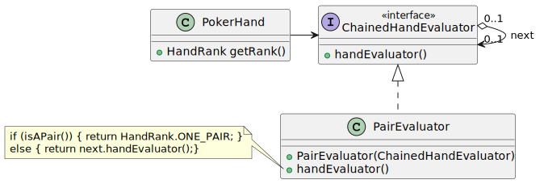

# CORSO INGEGNERIA DEL SOFTWARE A.A. 2024/25

## LABORATORIO 4

Ogni coppia di studenti procede a effettuare il **fork** di questo repository.
L'utente che ha effettuato il fork modifica questo README inserendo le opportune **informazioni sui
membri del team** seguendo lo schema sopra riportato.
Inoltre, concede i permessi di scrittura al proprio compagno di team e i **permessi di lettura** ai
docenti (`carlo.bellettini` e `mattia.monga`).


## Giocare a carte

Il codice fornito è una versione (adattata secondo le convenzioni Gradle) di parte del 
programma Solitaire, scritto da Martin P. Robillard. 

In questo esercizio si richiede di utilizzare le classi del *package*
`ca.mcgill.cs.stg.solitaire.cards` senza modificarle, nello spirito
dell'"Open/Closed Principle". Le classi prodotte dovranno far parte del
*package* `it.unimi.di.sweng.lab04`.

### Obiettivi

Si vuole avere una classe `PokerHand` che permetta di gestire un _gruppo di
carte_ e una classe `PokerTable` che gestisca un gruppo di giocatori rappresentato dalle rispettive `PokerHand`.

In particolare sviluppare con metodologia TDD:

- un costruttore di `PokerHand` a partire da una lista di `Card` (stando attenti a non cadere nell'errore 
  di introdurre un ReferenceEscaping)

- `PokerHand` espone il gruppo di carte di cui sono composti solo
  tramite un *iteratore* (Utilizzare il *pattern Iterator*, sfruttando l'interfaccia `Iterable` della
  libreria standard)

- Definire una classe `PokerTable` con la responsabilità di creare e gestire il `Deck` della partita e `n` 
  (passato come parametro) giocatori assegnando 5 carte a ciascuno.

- `PokerTable` deve essere `Iterable` sulle `PokerHand`.

- Gli oggetti `PokerHand` forniscono un metodo `getRank()` per determinare il
  punteggio di una mano (in caso di dubbio, le regole sono riassunte qui:
  https://en.wikipedia.org/wiki/List_of_poker_hands). I possibili punteggi (da sviluppare uno alla volta, 
  nell'ordine voluto, secondo una modalità TDD) sono:
  
```java
  public enum HandRank {
   HIGH_CARD,
   ONE_PAIR,
   TWO_PAIR,
   THREE_OF_A_KIND,
   STRAIGHT,
   FLUSH,
   FULL_HOUSE,
   FOUR_OF_A_KIND,
   STRAIGHT_FLUSH
  }
```
  
- L'implementazione del metodo `getRank()` rischia di cadere nell'anti-*pattern*
  "Switch Statement". Per evitarlo, è
  possibile organizzare la valutazione del punteggio secondo un *pattern*
  "Chain-of-responsibility": si definisce un'interfaccia `ChainedHandEvaluator`
  che espone un metodo che, dato un oggetto `PokerHand` ne calcola il punteggio
  (`HandRank`) corrispondente; per ogni tipologia di punteggio che si vuole
  valutare, occorrerà implementare un sotto-tipo appropriato di
  `ChainedHandEvaluator`. Ciascun sotto-tipo di `ChainedHandEvaluator` conosce
  anche il "prossimo" valutatore (comunicato col proprio costruttore): ciò
  permette di costruire una catena di valutatori. Si può perciò iniziare dal
  valutatore del punteggio più alto (`STRAIGHT_FLUSH`) che avrà come prossimo
  valutatore quello di `FOUR_OF_A_KIND`, ecc. La logica di valutazione sarà: se
  il valutatore riconosce lo schema del "proprio" punteggio, restituisce il
  valore opportuno (p.es. se il valutatore del tris trova 3 carte dello stesso
  valore nella `PokerHand` restituisce `THREE_OF_A_KIND`, altrimenti richiama il
  prossimo valutatore, probabilmente il valutatore di doppie coppie). **Non è
  _necessario_ realizzare tutti i valutatori ma almeno tre a vostra scelta.**
  


- La classe `PokerTable` deve fornire un metodo `PokerHand getHand(int i)` che
    restituisce una copia della mano del giocatore i-esimo;

- Gli oggetti `PokerHand` devono implementare l'interfaccia `Comparable`,
  ordinando le `PokerHand` secondo il valore restituito da `getRank()`. _Non c'è
  bisogno di definire l'ordinamento fra mani con lo stesso punteggio._

- Aggiungere a `PokerTable` un metodo `void change(int player, List<Card> toChange)` 
  che permetta di cambiare le carte della mano del giocare numero
  `player`, con il vincolo che almeno una deve restare invariata.
  Si può assumere (precondizione del contratto) che le carte indicate come da cambiare facciano 
  effettivamente parte della mano del giocatore e che almeno una carta non venga cambiata

- La classe `PokerTable` deve fornire un metodo che restituisce un iteratore su
  `Integer` che permetta di scorrere gli identificatori dei `player`
  ordinati dal punteggio più alto al più basso.
  
- Se rimane tempo completare i valutatori lasciati in sospeso e estendere
  il confronto di `PokerHand` in modo che risolva anche i casi di parità di
  ranking (vedi https://en.wikipedia.org/wiki/List_of_poker_hands)
