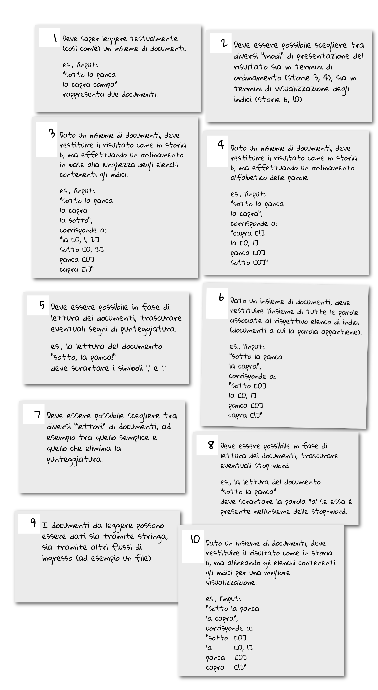

# CORSO INGEGNERIA DEL SOFTWARE A.A. 2024/25

## LABORATORIO 8

Ogni coppia di studenti procede a effettuare il **fork** di questo repository.
L'utente che ha effettuato il fork modifica questo README inserendo le opportune **informazioni sui
membri del team** seguendo lo schema sopra riportato.
Inoltre, concede i permessi di scrittura al proprio compagno di team e i 
**permessi di lettura** ai
docenti (`carlo.bellettini` e `mattia.monga`).

## Inverted Index

Lo strumento **InvertedIndex** consente di associare *elementi* di un insieme parole
alle rispettive sorgenti all'interno di un *insieme di documenti*.
Se assumiamo per semplicità che ogni documento sia composto da una
singola linea di testo contenente solo parole e numerato a partire da zero
(ma la numerazione non appare esplicitamente nell'input),
un possibile insieme di documenti è il seguente.

```text
0: Sopra la panca la capra campa!
1: sotto la panca
2: la capra crepa.
```

A cui corrisponde la seguente stringa risultante:

```text
Sopra    [0]
campa    [0]
capra    [0, 2]
crepa    [2]
la       [0, 1, 2]
panca    [0, 1]
sotto    [1]
```

ottenuta affiancando a ogni parola l'insieme degli indici associati ai documenti a
cui la parola appartiene e ordinando il risultato lessicograficamente in base alla parola.

Obiettivo dell'esercitazione è progettare e realizzare (secondo la **metodologia
TDD** e facendo uso di opportuni **design pattern**) una gerarchia di classi
atte a produrre lo strumento *InvertedIndex* a partire da un insieme di documenti.

#### Esempio di esecuzione

Le classi progettate devono poter essere in grado di accettare in ingresso un flusso di dati del tipo:

```text
Sopra la panca la capra campa
sotto la panca
la capra crepa
```

e rispondere restituendo una stringa simile a questa:

```text
la       [0, 1, 2]
capra    [0, 2]
panca    [0, 1]
Sopra    [0]
campa    [0]
crepa    [2]
sotto    [1]
```

che è ottenuta ordinando il risultato in base al numero di documenti associato alle parole in modo
decrescente e allineando le liste d'indici per ottenere un output più leggibile.

### Requisiti informali

Durante la stesura della specifica dei requisiti sono stati concordate le seguenti *user story*
che descrivono tramite piccoli esempi le funzionalità che il software dovrà implementare.
Il team di sviluppo è libero d'implementare le funzionalità nell'ordine che ritiene più opportuno.

A ogni *user story* presa in carico deve corrispondere un ramo `feature/` all'interno della history
di git.



Durante lo svolgimento non è importante implementare tutti i requisiti
descritti qui, ma è fondamentale progettare il codice in modo che possa essere
esteso, con uno sforzo ragionevole, nelle direzioni qui descritte.

### Suggerimenti

Fermo restando che ciascun gruppo può effettuare le scelte architetturali che ritiene
più opportune nel realizzare l'esercizio, di seguito si accenna ad alcuni suggerimenti che potrebbero risultare particolarmente utili.

*  In riferimento alla *user story 9*, la lettura dell'*input* deve avvenire usando un
   [Reader](https://docs.oracle.com/en/java/javase/17/docs/api/java.base/java/io/Reader.html),
   non necessariamente [System.in](https://docs.oracle.com/en/java/javase/17/docs/api/java.base/java/lang/System.html#in),
   questo per rendere più agevole sia il test sia l'eventuale estensione a
   casi in cui l'input non provenga dalla console.

* In una versione preliminare è ragionevole che i documenti vengano letti
  testualmente (*user story 1*), ma è bene progettare la lettura così che possa essere estesa
  nelle eventuali versioni successive (*user story 5, 8*) in modo da: trascurare i segni
  d'interpunzione (punto, virgola, due punti...) e da eliminare le *stop word*
  (ossia le parole ricorrenti come le preposizioni, gli articoli...,
  specificate in un apposito elenco).
  La lettura dell'*input* potrebbe essere fatta tramite diverse
  implementazioni di un **Iterator**.
  Le varie implementazioni potrebbero essere costruite
  grazie a delle **Factory**, eventualmente raccolte sotto il cappello di
  una **Abstract Factory**.

* Il formato della stringa prodotta non deve essere unico e prefissato:
  in prima istanza può avere il formato descritto nella *user story 6*,
  ma un ulteriore formato da prevedere potrebbe essere quello presente in *user story 3*,
  *user story 4*, oppure *user story 10*;
  è pertanto bene prevedere la possibilità di future estensioni in questo senso.
  L'*ordinamento* dell'indice e la stringa risultante potrebbero essere prodotti in vari modi
  a seconda del tipo d'indice e del formato desiderato, attraverso l'uso di
  una serie d'implementazioni di differenti **Strategy**.


### Rilasci del software

Il primo rilascio del software `v1.0` è previsto al termine dello sviluppo delle
funzionalità di base, ovvero dopo avere implementato e verificato 2 *user story*. 
La versione finale del software che comprende anche lo svolgimento
dei requisiti informali deve dare luogo alla release finale `v2.0`.

Per ogni funzionalità aggiuntiva sviluppata, qualora il gruppo lo ritenga opportuno, è possibile effettuare ulteriori release,
ad esempio a fronte di modifiche sostanziali dalla precedente versione, dovute a refactoring e/o introduzione di *design pattern*.

Al termine dell'esercitazione, se la versione finale non è stata raggiunta, eseguire un'ultima release `time-up` lasciando i rami `feature/` incompleti aperti, dopodiché un *push* (di tutti i *branch*).


