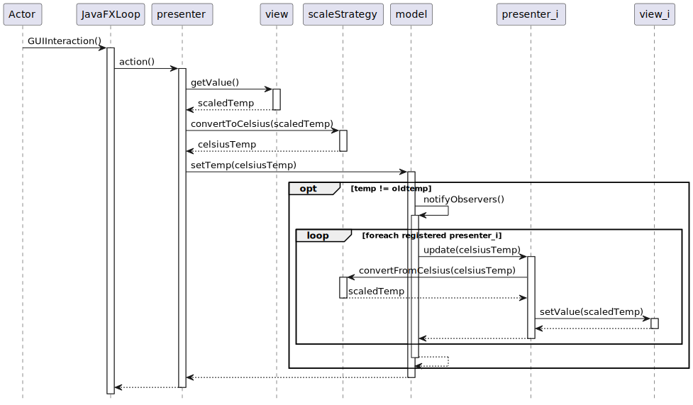

# CORSO INGEGNERIA DEL SOFTWARE A.A. 2024/25

## LABORATORIO 09

* TEAMMATE 1: Isetta Mattia 02265A
* TEAMMATE 2: Panetta Andrea 984811

Ogni coppia di studenti procede a effettuare il **fork** di questo repository.
L'utente che ha effettuato il fork modifica questo README inserendo le opportune **informazioni sui
membri del team** seguendo lo schema sopra riportato.
Inoltre, concede i permessi di scrittura al proprio compagno di team e i **permessi di lettura** ai
docenti (`carlo.bellettini` e `mattia.monga`).

## Processo

Il progetto va implementato secondo la *metodologia TDD*, utilizzando `git flow`, quindi occorre iniziare con un `git flow init`.
Poi ripetere i passi seguenti fino ad aver implementato tutte le funzionalità richieste:

* creare un nuovo *branch* per la funzionalità corrente attraverso l'esecuzione del comando `git flow feature start`,
* implementare un test per le funzionalità volute;
* verificare che **il codice compili correttamente**, ma l'**esecuzione del test fallisca**;
  solo a questo punto effettuare un *commit* iniziando il messaggio di commit con la stringa `ROSSO:`,
* aggiungere la minima implementazione necessaria a realizzare la funzionalità, in modo che **il
  test esegua con successo**; solo a questo punto
  effettua un *commit* iniziando il messaggio di commit con la stringa `VERDE:`,
* procedere, se necessario, al **refactoring** del codice, accertandosi che le modifiche non
  comportino il fallimento di alcun test; solo in questo caso fa seguire a ogni
  passo un *commit* iniziando il messaggio di commit con la stringa `REFACTORING:`,
* eseguire il *merge* del *branch* per la funzionalità sviluppata all'interno del *branch develop*
  attraverso il comando `git flow feature finish`,
* **solo in fase di rilascio**, esegue una *release* all'interno del *branch master* attraverso il comando `git flow release start` e successivamente `git flow release finish`,
* effettua un *push* (di tutti i *branch*) con `git push origin --all --follow-tags`.

Al termine del laboratorio effettua una **ultima release**, un ultimo *push*, e **verifica su gitlab** che ci sia la completa traccia di *commit* effettuati.

### Modello MVP

### Requisiti informali

Il progetto deve tener conto dei seguenti requisiti:

* Le viste ci permettono di leggere e di impostare la temperatura usando diverse scale (unità di misura). Sono richieste 2 tipologie di viste:
   (1) un [TextField](https://openjfx.io/javadoc/17/javafx.controls/javafx/scene/control/TextField.html) in gradi Celsius (ce ne sono però due istanze, facoltativo se avrete finito il resto: una rendetela readonly), (2) un [TextField](https://openjfx.io/javadoc/17/javafx.controls/javafx/scene/control/TextField.html) in gradi Fahrenheit.

* Una componente aderente alla interfaccia `Model` si occupa di mantenere il dato *temperatura*
  tramite un `double` che rappresenta la misura in gradi Celsius. È unica e
  comune a tutte le viste. Il `Model` a fronte di un cambiamento della
  temperatura, deve occuparsi di *notificare* tutti i `Presenter` a lui registrati.
  Internamente mantiene le temperature secondo la scala Celsius. 
  Il `Model` deve essere capace di gestire sia una comunicazione con approccio *pull* che *push*.

* Una componente aderente alla interfaccia `Presenter` sta nel mezzo tra `View` e `Model` ed
   interpreta l’input dell’utente (l’inserimento di un valore nel `TextField`).
   Un'istanza di `Presenter` (una per ogni vista) a fronte dell'interazione
   dell'utente deve aggiornare il `Model` con la nuova temperatura appena
   immessa.
   Inoltre deve essere in grado di *osservare* un cambiamento di temperatura nel 
   termostato in modo da aggiornare il valore mostrato all'utente dalla vista a lui collegata.

* Per quanto riguarda i `Presenter`: l'approccio usato nel diagramma di sequenza prevede una classe unica (`TemperaturePresenter`). 
  Le due strategie `CelsiusScale` e `FahrenheitScale` possono essere realizzate usando il pattern  `Singleton`.

Sono già fornite come codice:
 * le interfacce `Model`, `Presenter`, `View`, `Observable` e `Observer`.
 * la classe `MyTextView` (completa).
 * la classe `Main` da completare.
 * un inizio di classi di test per `TemperatureModel` (nel source set `test`) e per il sistema una volta completato (nel source set `integrationTest`).
