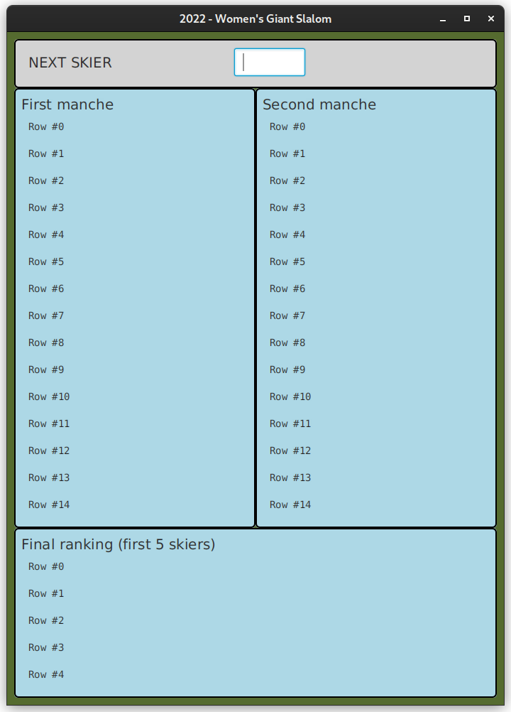
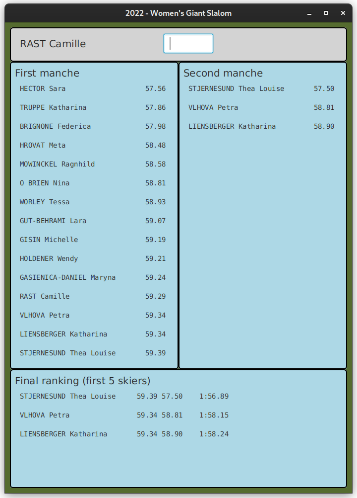
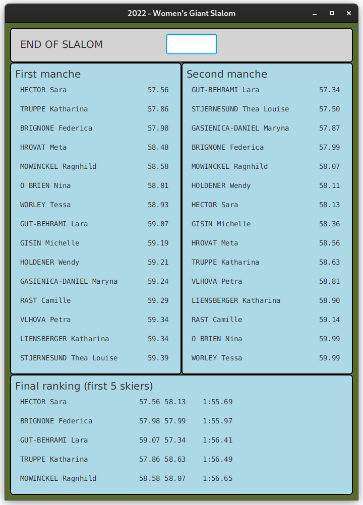

# CORSO INGEGNERIA DEL SOFTWARE A.A. 2024/25

## LABORATORIO 10

## Processo

Il progetto va implementato secondo la *metodologia TDD*, utilizzando `git flow`, quindi occorre iniziare con un `git flow init`.
Poi ripetere i passi seguenti fino ad aver implementato tutte le funzionalità richieste:

* creare un nuovo *branch* per la funzionalità corrente attraverso l'esecuzione del comando `git flow feature start`,
* implementare un test per le funzionalità volute;
* verificare che **il codice compili correttamente**, ma l'**esecuzione del test fallisca**;
  solo a questo punto effettuare un *commit* iniziando il messaggio di commit con la stringa `ROSSO:`,
* aggiungere la minima implementazione necessaria a realizzare la funzionalità, in modo che **il
  test esegua con successo**; solo a questo punto
  effettua un *commit* iniziando il messaggio di commit con la stringa `VERDE:`,
* procedere, se necessario, al **refactoring** del codice, accertandosi che le modifiche non
  comportino il fallimento di alcun test; solo in questo caso fa seguire a ogni
  passo un *commit* iniziando il messaggio di commit con la stringa `REFACTORING:`,
* eseguire il *merge* del *branch* per la funzionalità sviluppata all'interno del *branch develop*
  attraverso il comando `git flow feature finish`,
* **solo in fase di rilascio**, esegue una *release* all'interno del *branch master* attraverso il comando `git flow release start` e successivamente `git flow release finish`,
* effettua un *push* (di tutti i *branch*) con `git push origin --all --follow-tags`.

Al termine del laboratorio effettua una **ultima release**, un ultimo *push*, e **verifica su gitlab** che ci sia la completa traccia di *commit* effettuati.

## Specifica dei requisiti

### SLALOM GIGANTE FEMMINILE: seconda _manche_

Obiettivo dell'esercizio è progettare e realizzare un insieme di classi atte a
produrre un programma Java che si occupi di gestire la classifica di
una gara di slalom gigante femminile. Vengono fornite già alcune classi e il programma va completato in modo da realizzare 
un'organizzazione del sistema di tipo *Model-View-Presenter*.

In particolare vengono fornite due *Viste* del sistema:

- `NextSkierView`: la vista che permette di chiedere e immettere il tempo ottenuto da una
  sciatrice nella seconda _manche_;
- `DisplayView`: un display generale che permette di visualizzare alcune righe di
 testo e può essere usato per visualizzare la graduatoria, cioè un elenco di
 nomi di sciatrici e i loro tempi, ordinati per tempi crescenti e a parità di tempo in ordine alfabetico decrescente 
  (vedi esempio in figura VHLOVA e LIENSBERGER).

Il programma deve mostrare 3 classifiche:

1. la classifica della prima _manche_ già completata: i dati (nomi e tempi) delle 15 
   (`Main.SKIER_NUM`) sciatrici ammesse alla seconda 
   *manche* sono caricati una volta per tutte da un file (`src/main/resources/prima`)
   tramite la funzione `readFilePrimaManche` della classe `Model` (da completare);
2. la classifica della seconda _manche_: i cui tempi vengono immessi man mano che le
   sciatrici gareggiano in ordine inverso rispetto alla classifica della prima
   _manche_: l'ultima sciatrice della prima _manche_ è la prima a scendere nella seconda _manche_;
3. la classifica finale delle prime 5 (`Main.SKIER_NUM_TOTAL_RANK`) sciatrici, che tiene conto della somma dei tempi 
   delle due _manche_.

Lanciando il programma (tramite il task **run** di gradle) si ottiene inizialmente una
interfaccia come quella nella figura sottostante.

Dopo aver caricato correttamente il file della prima manche, si dovranno inserire nella vista in alto i tempi delle 
seconde _manche_ delle sciatrici il cui nome comparirà al posto della scritta **NEXT SKIER**.

Ad esempio dopo l'inserimento dei tempi delle prime 3 sciatrici della seconda _manche_ la situazione presentata 
potrebbe essere
la seguente (con le classifiche parziali della seconda _manche_ e totale  e con la richiesta del tempo della 
quart'ultima sciatrice della prima _manche_ _Camille RAST_).

Chiaramente le classifiche della seconda _manche_ e totale, rimangono in evoluzione fino alla discesa della ultima sciatrice.

Scesa l'ultima sciatrice, deve comparire la scritta **END OF SLALOM** e non accadere più nulla anche provando a inserire 
altri tempi.

Per semplicità potete assumere che:
- i tempi delle singole _manche_ siano sempre inferiori al minuto
- non ci siano sciatrici che non completano la gara

Alcuni test di integrazione sono già forniti e vanno fatti passare tutti:
controllano anche situazioni di input errato: riflettete su dove assegnare la
responsabilità dei controlli a seconda del tipo di errore da rilevare.