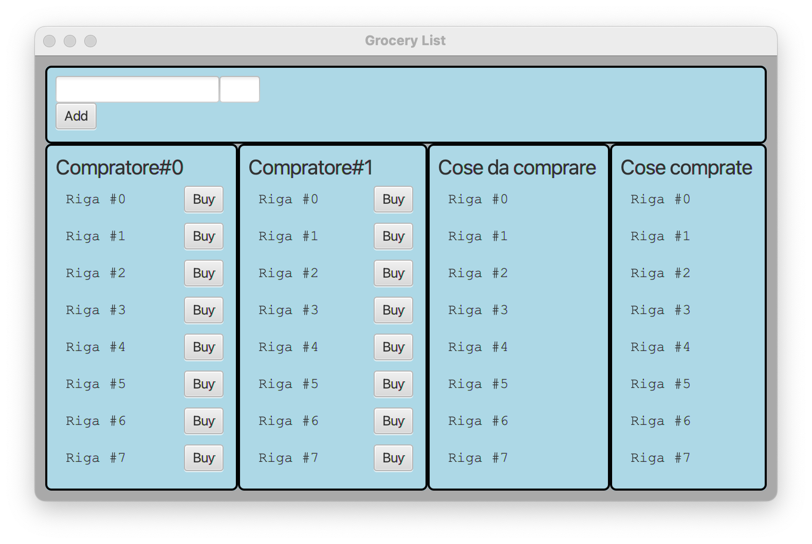
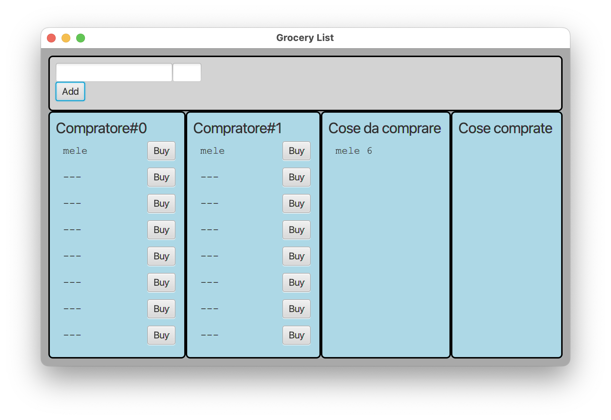
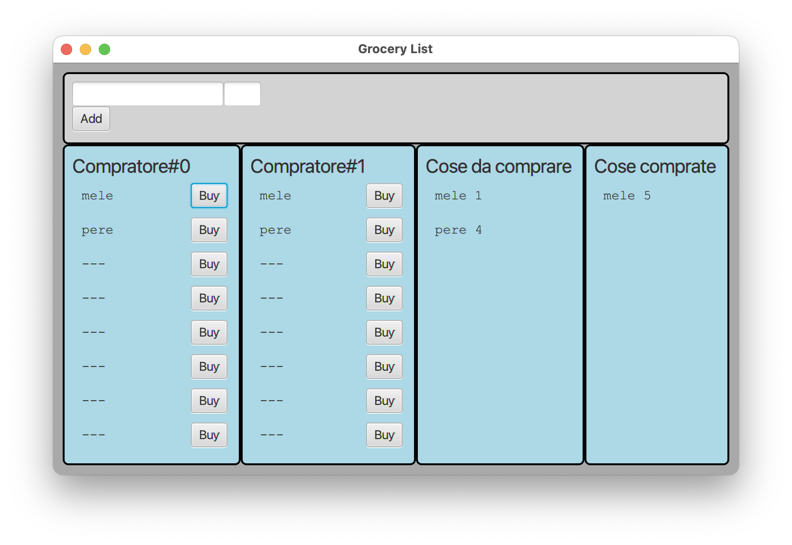
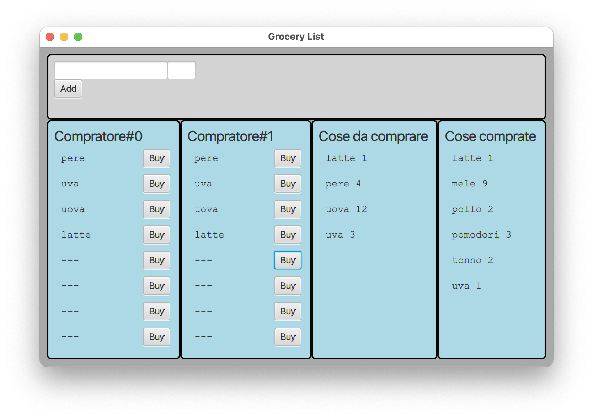

# CORSO INGEGNERIA DEL SOFTWARE A.A. 2024/25

## LABORATORIO 11

## Lista della spesa distribuita

Obiettivo dell'esercizio è progettare e realizzare un insieme di classi atte a produrre un semplice programma Java che
si occupi di gestire una lista della spesa condivisa (limitata a max 8 alimenti) tra diverse persone.

Vengono già fornite tre *Viste* del sistema:

- [`InputAlimentView`](src/main/java/it/unimi/di/sweng/lab11/view/InputAlimentView.java): mette a disposizione due caselle di testo
  (alimento + quantità) e un bottone per aggiungere alla lista una certa *quantità* di *alimento*.
- [`CommandView`](src/main/java/it/unimi/di/sweng/lab11/view/CommandView.java): permette ai *compratori* di dichiarare
  (tramite pressione del bottone `Buy` relativo) di avere comprato una unità di alimento tra quelli richiesti (l'ordine 
  è arbitrario ma non ci possono essere "buchi").
- [`DisplayView`](src/main/java/it/unimi/di/sweng/lab11/view/DisplayView.java): permette di visualizzare un elenco di
  alimenti (ordinati alfabeticamente) e quantità disponibile sia per gli articoli ancora da comprare sia per quelli già comprati.

Viene fornita anche una prima versione della classe  [`Main`](src/main/java/it/unimi/di/sweng/lab11/Main.java) che
permette d'istanziare la parte statica delle viste, e di una
interfaccia [`InputPresenter`](src/main/java/it/unimi/di/sweng/lab11/presenter/InputPresenter.java).

**TUTTE LE CLASSI DATE POSSONO ESSERE DA VOI MODIFICATE (CANCELLATE, COMPLETATE) PER ADERIRE A VOSTRE IDEE DI
PROGETTAZIONE**

Lanciando il programma (tramite il task `run` di gradle) si ottiene una interfaccia simile a quella nella figura
sottostante.

## TRACCIA

Completare, in modo da realizzare un'organizzazione del sistema di tipo
*Model-View-Presenter*, aggiungendo le classi necessarie (`GroceryListModel`,
`CommandPresenter`, ...) in modo che alla pressione dei bottoni `Add` e `Buy` si aggiornino coerentemente le varie
viste.

### Esempio di esecuzione

Alla partenza ci dovremo trovare nella seguente situazione:

Dopo avere indicato di aver bisogno di comprare **6 mele**...

Dopo avere indicato di avere bisogno anche di **4 pere** e avere comprato **5** delle **6 mele** richieste...

Da notare che ad esempio nella situazione seguente non sarebbe più possibile
aggiungere nuovi alimenti da comprare
essendo già stato raggiunto il numero massimo (`8` espresso dalla
costante `Main.MAX_FOOD`: uva, uova, pere, latte, pomodori, mele, tonno, pollo)

### Gestione input errati

Nel caso in cui l'utente inserisca un input non valido (ad esempio una stringa vuota, un numero negativo, etc.) il sistema
deve mostrare un messaggio di errore (tramite il metodo `showError`) nella vista appropriata.

Oltre che nei **test di unità**, aggiungere ai **test di integrazione** almeno un paio di controlli di input errati.

### Processo

Una volta effettuato il **clone** del repository, il gruppo completa l'implementazione seguendo la *metodologia TDD*;
in maggior dettaglio, ripete i passi seguenti fino ad aver implementato tutte le funzionalità richieste:

* scelta la prossima funzionalità richiesta da implementare, inizia una feature di gitflow
* implementa un test per la funzionalità,
* verifica che **il codice compili correttamente**, ma l'**esecuzione del test fallisca**; solo a questo punto effettua
  un *commit*
  (usando `IntelliJ` o `git add` e `git commit`) iniziando il messaggio di commit con la stringa `ROSSO:`,
* aggiunge la minima implementazione necessaria a realizzare la funzionalità, in modo che **il test esegua con
  successo**; solo a questo punto
  effettua un *commit* (usando `IntelliJ` o `git add` e `git commit`) iniziando il messaggio di commit con la
  stringa `VERDE:`,
* procede, se necessario, al **refactoring** del codice, accertandosi che le modifiche non
  comportino il fallimento di alcun test; solo in questo caso fa seguire a ogni
  passo un *commit* (usando `IntelliJ` o `git add` e `git commit`)
  iniziando il messaggio di commit con la stringa `REFACTORING:`,
* ripete i passi precedenti fino a quando non considera la funzionalità realizzata nel suo complesso e allora chiude la
  feature di gitflow
* effettua un *push* dei passi svolti su `gitlab.di.unimi.it` con `IntelliJ` o`git push --all`.

### Testing

Mano a mano che si sviluppa il progetto, si deve controllare di mantenere una copertura, sia dei comandi che delle
decisioni, soddisfacente (se inferiore al 100% inserire un commento che spieghi perché non è possibile raggiungerlo).

È presente anche uno scheletro di test di integrazione che (una volta completato nella inizializzazione) il progetto
alla fine "dovrebbe" passare (ricalca l'esecuzione delle prime tre figure). Aggiungere quanto necessario per creare e 
controllare la situazione presentata nella quarta figura. 

### Consegna

Al termine del laboratorio dovete impacchettare l'ultima versione stabile come una _release_ di gitflow chiamata 
"consegna" ed effettuare un ultimo *push* di tutti i rami locali (comprese eventuali feature aperte ma non completate).

## **Verificate su `gitlab.di.unimi.it`** che ci sia la completa traccia dei *commit* effettuati nei vari *branch* e che ci siano anche i *tag*. Infine chiaramente anche di averne dato visibilità ai docenti. 
